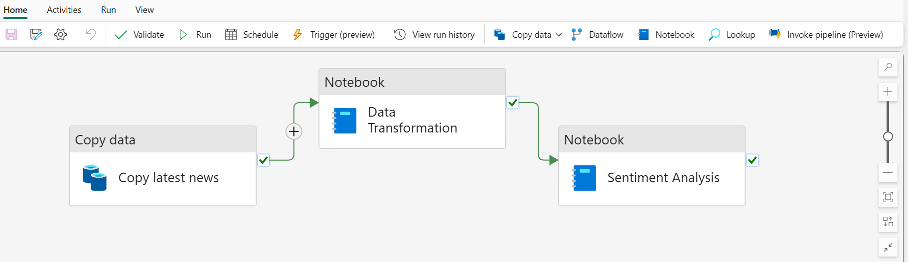
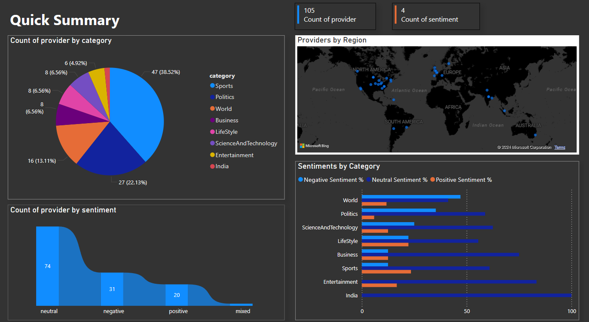
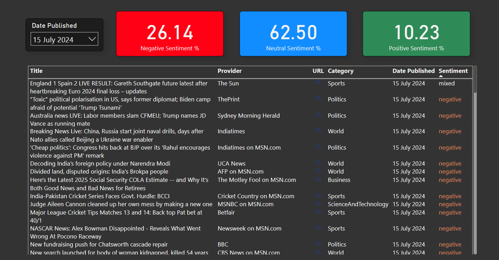
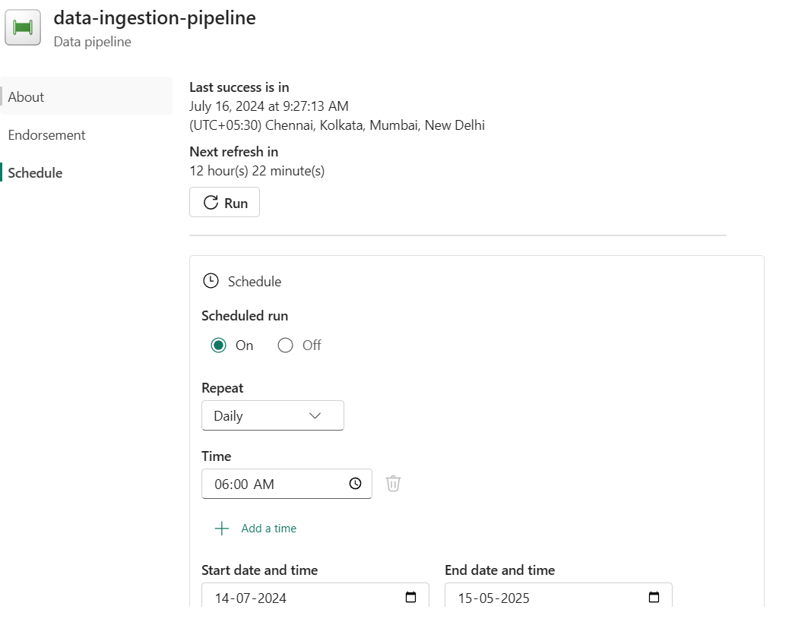
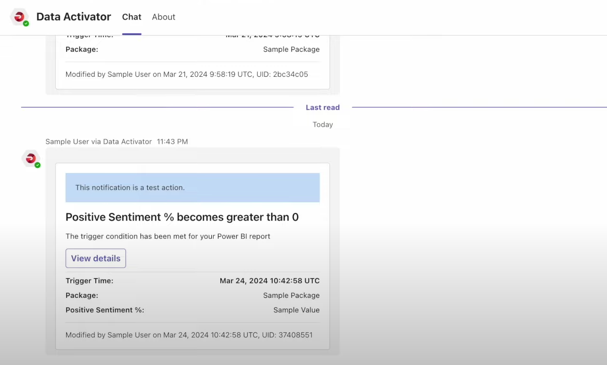
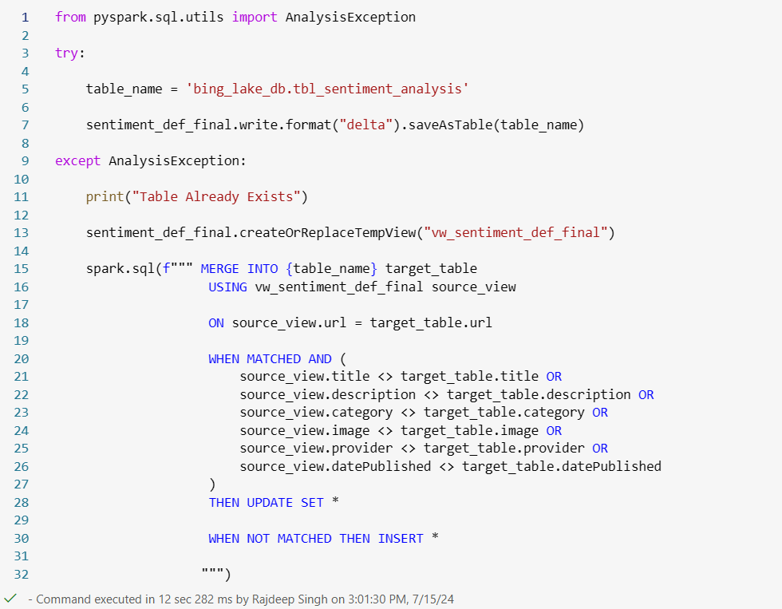
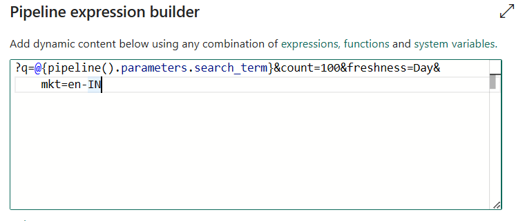

# realtime-news-sentiment-analytics
### Features:
-   End-to-end data pipeline with incremental load using SQL Merge (Type 1), preventing duplicates and reducing processing time by 30%.
  

-   Real-time sentiment analysis on news data using pre-trained ML models with 90% accuracy.
-   Interactive Power BI dashboard with real-time updates, displaying news and sentiment analysis, refreshed every 24 hours.
  

[live](https://app.fabric.microsoft.com/links/sTYdwMONxy?ctid=2d2d6be3-2654-49bf-8b51-ec16d766d370&pbi_source=linkShare&bookmarkGuid=04623a26-7ce4-45dc-acd4-003c5c0873c4)
-   Automated alerts with Data Activator for critical updates, enhancing monitoring efficiency by 40%.
    

### Add-ons:

-   Optimized data transformations with PySpark
-   Structured data storage in Delta Lake, improving query performance
-   Secure and efficient API integration with Bing API, achieving a 15% increase in data ingestion speed.
  

### Challenges and Solutions

1\. **Data Duplication in Tables:**

    - **Challenge:** Adding data to a table that already contains some of the same data could result in duplicates, causing performance issues and unnecessary volume increase.

    - **Solution:** Use the **incremental load** technique to selectively load only new data.

    - **Technique:**

        - **SQL Merge Types:**

            - **Type 1 (Slowly Changing Dimension Type 1):** Updates existing records. If a matching ID is found, the record is updated; if not, a new record is inserted.

            
    - **Options Considered:**

        - Full data load: Reloading entire dataset, inefficient and resource-heavy.

        - Delta Lake: For real-time data processing, but required a shift in existing architecture.

2\. **Ingesting News Articles Using Bing API:**

    - **Challenge:** Collecting the latest news articles with relevant filters and parameters.

    - **Solution:** Use query parameters in the Bing API to refine data collection.

    - **Techniques:**

        - **Query Parameters:**

            - **Count:** Set to 100 to get up to 100 news articles.

            - **Freshness:** Set to 'day' to get articles from the last 24 hours.

            - **Market (MKT):** Adjusts the region of the news. Example: 'en-IN' for India.

        - **Headers and Authentication:** Use API keys in headers for authentication with the Bing API.

    - **Options Considered:**

        - Manual data scraping: Risky and unreliable, especially for large-scale data.

        - Other APIs: Limited scope and coverage compared to Bing API.

3\. **Handling Large JSON Files:**

    - **Challenge:** Efficiently reading and processing large JSON files.

    - **Solution:** Utilize PySpark for data transformation.

    - **Techniques:**

        - **Reading JSON:** Use PySpark's `spark.read.option` to read JSON files into a DataFrame.

        - **DataFrame Operations:** Transform and process the data using PySpark DataFrame operations, such as `select` and `explode`.

    - **Options Considered:**

        - Native Python libraries (e.g., pandas): Struggles with large datasets.

        - Apache Hive: Suitable for batch processing but not ideal for real-time processing.

4\. **Data Transformation and Storage:**

    - **Challenge:** Transforming raw JSON data into structured formats and storing them efficiently.

    - **Solution:** Use Synapse Data Engineering for transformation and Delta Lake for storage.

    - **Techniques:**

        - **Synapse Data Engineering:** Transform data using Spark SQL and notebooks.

        - **Delta Lake:** Store transformed data in a structured, optimized format.

    - **Options Considered:**

        - HDFS: Scalable storage but lacks optimization for analytics.

5\. **Real-Time Sentiment Analysis:**

    - **Challenge:** Performing sentiment analysis on incoming news data in real-time.

    - **Solution:** Use Synapse Data Science with pre-trained machine learning models.

    - **Techniques:**

        - **ML Models:** Apply pre-trained text analysis models for sentiment scoring.

        - **Batch Processing:** Process incoming data in mini-batches for real-time analysis.

    - **Options Considered:**

        - Custom ML models: Time-consuming to develop and train.

        - Third-party sentiment analysis services: Higher cost and potential latency issues.

6\. **Establishing API Connections:**

    - **Challenge:** Setting up and testing connections to external APIs.

    - **Solution:** Create connections using Microsoft Fabric and configure necessary authentication.

    - **Techniques:**

        - **Connection Setup:** Use anonymous authentication initially, then add necessary headers for API key authentication.

        - **Testing Connections:** Utilize tools provided by Microsoft Fabric to test and verify the connection.

    - **Options Considered:**

        - Manual API calls: Time-consuming and error-prone.

        - Third-party connectors: Additional cost and potential compatibility issues.
